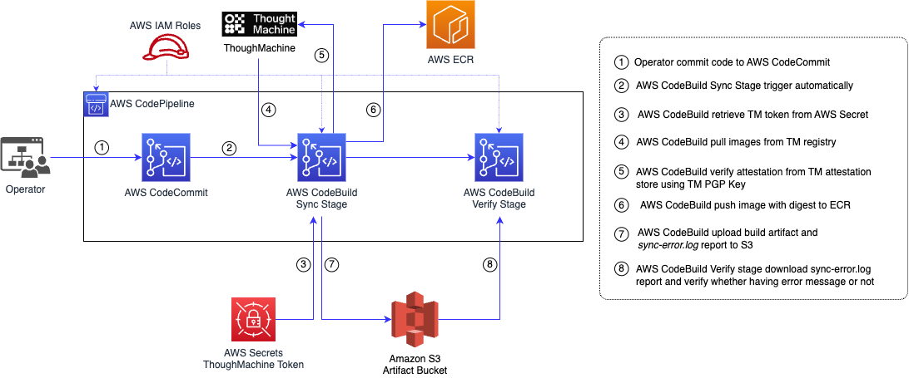
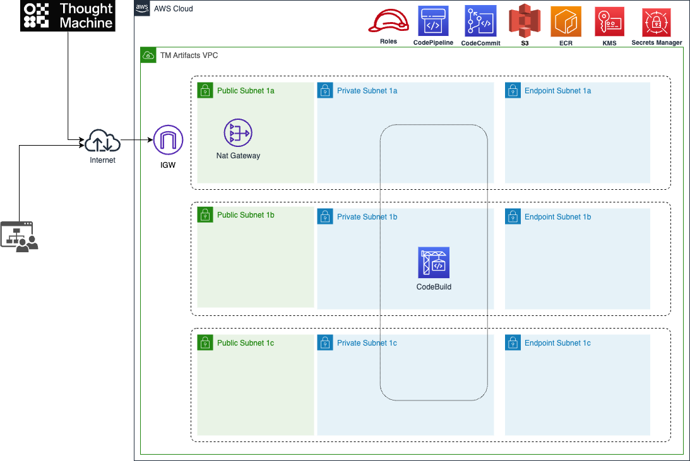
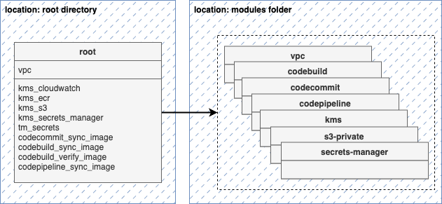

# Overview 
The document illustrates the steps to copy ThoughtMachine Docker images to the ECR repository for TM installation or version upgrade. Additionally, it also creates ECR repositories if they do not exist. Currently, the script has only been tested on AWS CodeBuild with AWS Amazon Linux 2 OS. If you run the script in another OS or environment, please ensure that it is working.
This project contains two folders:
- Build: contain all the files for running pipeline

<p align="center">
  
</p>
- Infra: terraform code for provision infrastruture
<br/><br/>
<p align="center">
  
</p>

**Input parammeters**

| Parammeter name | Default value | Description | 
| ------------- | ------------- | ------------- |
| --srcusr  | _tm | User to allow login source repository |
| --srcpasswd | ENVIRONMENT_VARIABLE | Token as a password to login source repository, contact administrator for the token and store it in ```tm-sync-token``` of AWS Secret Manager|
| --srcdomain | docker.external.thoughtmachine.io | Source docker repository |
| --trgprefix | /3rdparty/tm/ | Prefix when create ECR repository for example: /3rdparty/tm/vault/xpl/xpl_payees |
| --trgregion | ENVIRONMENT_VARIABLE | Where the script running and ECR created | 
| --src_packages_postfix | images.txt | This postfix allows the script to look for all images in files that have this postfix to migrate |
| --src_release_postfix | release.json | This postfix allows the script to search for all release JSON files. The JSON files that contain the postfix contain information about the Docker digest and layer information.|
| --trg_ecr_policy_file_path | ecr_policy.json | ECR policy | 
| --trg_ecr_lifecycle_file_path | ecr_lifecycle_policy.json | ECR lifecycle policy where define rule for the repo | 
| --trg_resource_tags_file_path | resource_tags.txt | ECR resource tags, contact administrator to update this file | 
| --trg_kms_key_alias | ENVIRONMENT_VARIABLE | KMS which allow to encrypt/decrypt docker image, it's in alias arn format |
| --trg_dst_security_scan_enabled | False | For security purposes, the image after push to ECR will be scan for finding vulnerability |
| --throttle_ecr_creation_ms | 100 | To avoid multiple ECR repo create in short time causing throttling |
| --src_attestions_address | https://attestations.external.thoughtmachine.io/v1beta1/projects/tm-attestations-project/notes/tm-release-attestor-note/occurrences | The image with digest will be verified to make sure that image is from thoughtmachine |
| --gnupgdir | /root/.gnupg | GPG verification checking |
| --src_attestor | src_attestor.pgp | Public key for GPG checking provide by thoughmachine official package release |

Most of those parammeters can use default values. The command use those input arguments mentioned at ```line 30``` in ```buildspec_build.yaml```
```
 python3 syncrepos.py --trgprefix=/3rdparty/tm/ \
    --trgregion=eu-central-1 --src_packages_postfix=images.txt \
    --src_release=release.json --trg_kms_key_alias=$ECR_KMS_ARN \
    --throttle_ecr_creation_ms=1000
```
# Prerequisite
## Infrastructure provisioning
The infrastructure under ```./infra``` folder containing all the resources required to migrate the images required by TM to the AWS ECR.
<br/>
<p align="center">
  
</p>

1. Project contains the following terraform resources:
    - VPC networking
    - Separate Key Manament Service (KMS) for S3, Secret Manager, CloudWatch logs, ECR
    - S3 bucket for storing CodePipeline Artifacts
    - AWS CloudWatch Logs for storing output logs of build stage
    - AWS Secret Manager for storing ThoughMachine secret token
    - AWS CodeCommit for storing script & release files from ThoughMachine
    - AWS CodeBuild provide a environment for running script
    - AWS CodePipeline manages activities of continous delivery
2. To deploy the resources
    1. Install the AWS CLIv2 on your local machine and configure the target AWS account credentials - confirm if the cli is set to the proper account by running "aws sts get-caller-identity"
    2. Install terraform on your local machine
    3. Create dedicated private s3 bucket on the chosen account and reconfigure the project to place the terraform state file on this bucket (using backend.tf file)
    4. Please review and update the project configuration variables in terraform.tfvars file
    5. Go to the project catalog and run:
        1. terraform init - to initialize the workspace
        2. terraform plan - to confirm the plan and all the settings of resources to be created
        3. terraform apply - to provision the resources
## Update parammeter
1. Update ECR policy in file ```awsaccounts_read_binaries.txt```
- The file contains a list of AWS Account IDs that have permission to access the ECR TM binaries. Please ask the administrator for the list of Account IDs and add a new line to it.
2. Update ECR resource tags, the resource tags define in ```resource_tags.json``` file and in list of dict. Contact Administrator to define & update resource tags properly.
3. Copy release artifacts, contact Thoutmachine to download release package, unzip the package and copy two kind of files to sync-tm-docker-repo:
- release.json: json file contains information about docker: digest, layers information (for version 5 you only need to prepare this file)
- tm_registry_images.txt, byo_images.txt: a list of images with tags which intent to copy to ECR (since version 5 these files are not shared)

The names of those files might be changed for each release version, so discuss with the team before copying those files to the folder. Before copy to the folder, update the file name with a prefix is ThoughMachine release version. For example:
- release.json -> 3.3.11_release.json
- tm_registry_images.txt -> 3.3.11_tm_registry_images.txt (only for version 4 and earlier)
- byo_images.txt -> 3.3.11_byo_images.txt (only for version 4 and earlier)

**Note:** Please note that, it's difficult to detect which files contain a list of images, so all the image files will have postfix ```images.txt``` for naming convention. For example: ```tm_registry_images.txt```, ```byo_images.txt```. The script will look for all files have this postfix.
**Note 2:** For version 5, the script will only use the ```<TM_VERSION>_release.json``` file. The other files are unnecessary.

# Implement
## Step 1: Update token in AWS Secret Manager
Ask administrator for a ThoughMachine token and store it in AWS Secret Manager, the secret name is: ```tm-sync-token``` with format plaintext is:
```
{"TM_TOKEN":"<REPLACE_TOKEN_HERE>"}
```
Put the token in ```<REPLACE_TOKEN_HERE>``` placeholder.
## Step 2: Update file in AWS CodeCommit
### Option 1: First commit after provision infra
Assume that infrastructure deployed, follow the steps to trigger the pipeline:
- Commit alls files under ```sync-tm-docker-repo/build``` folder and ```<TM_VERSION>_<USER_DEFINED_STRING>_images.txt``` and ```<TM_VERSION>_release.json``` file to a feature branch of AWS CodeCommit repository.
- Create pull request to merge to main.
- The AWS Code Pipeline will trigger automatically for any sources file changes. Waiting for Pipeline run successful and check the output.
### Option 2: Update files
- Pull the latest code from the AWS CodeCommit repository.
- Check out the feature branch and update the changes.
- Commit the code and create a pull request to request a merge into the main branch.
- After the review, if the code is merged, the pipeline will be triggered automatically.
## Step 3: Verify
During the time pulling and pushing docker images, if there is an error, the script will print out **AWS CodeBuild logs**.  After the build process, an error report will be uploaded to the S3 bucket with the name: ```tm-artifacts-<AWS_ACCOUNT_ID>-sync-pipeline-s3``` and file name is ```sync-error.log```. The S3 bucket has versioning enabled, so if you need to check an old error report file, you can switch to *Show versions* and locate the ```sync-error.log``` file that matches the time when the build was run. The AWS Pipeline has a verification stage that checks whether the error log file is empty or not. If the error log is empty, the verification stage returns success. If the error log is not empty, it will return an error. In this case, you will need to go to the S3 bucket and check the ```sync-error.log``` file for more details.
## Step 3: Fix potenial error related to images that cannot be sourced from the Thought Machine Registry
In the list of images, there may be images that cannot be shared in Thought Machine Registry. In that case, an error similar to this one will appear:
```
INFO: START: restricted/third_party/docker.io/grafana/grafana:vault-5.0.3
ERROR: Verify image against attestation failed, fully qualify image name: docker.io/grafana/grafana@sha256:0679e877ba204cede473782d5aba962831a3449092da120aba7d24082efe3fde
```
In this case, you need to download the image manually and upload it to ECR. It is crucial that the hash digest is identical in the original repo and the target repo. For this reason, you cannot use the standard copy procedure with docker cli only the method described below:
1. Install the Crane tool provided by Google. The installation procedure is made available on the site: https://github.com/google/go-containerregistry/tree/main/cmd/crane
2. Log in to the ECR repository
   ```
   aws ecr get-login-password --region eu-central-1 | docker login --username AWS --password-stdin 766697957974.dkr.ecr.eu-central-1.amazonaws.com
   ```
3. Copy the image between the original repository and ECR:
   ```
   crane copy grafana/grafana@sha256:0679e877ba204cede473782d5aba962831a3449092da120aba7d24082efe3fde 766697957974.dkr.ecr.eu-central-1.amazonaws.com/3rdparty/tm/restricted/third_party/docker.io/grafana/grafana:vault-5.0.3
   ```
4. Run the image import process again.